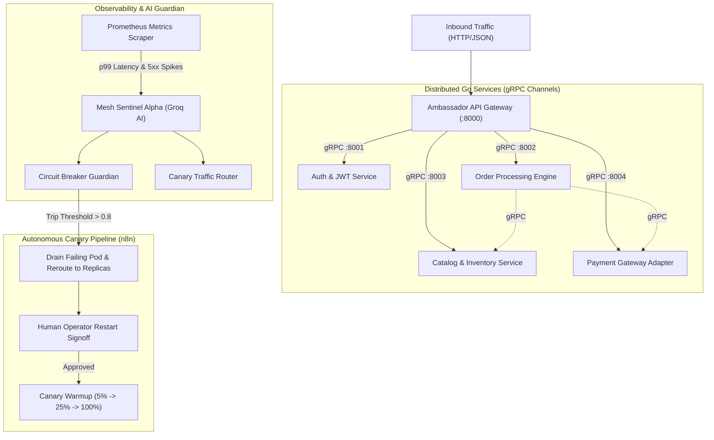
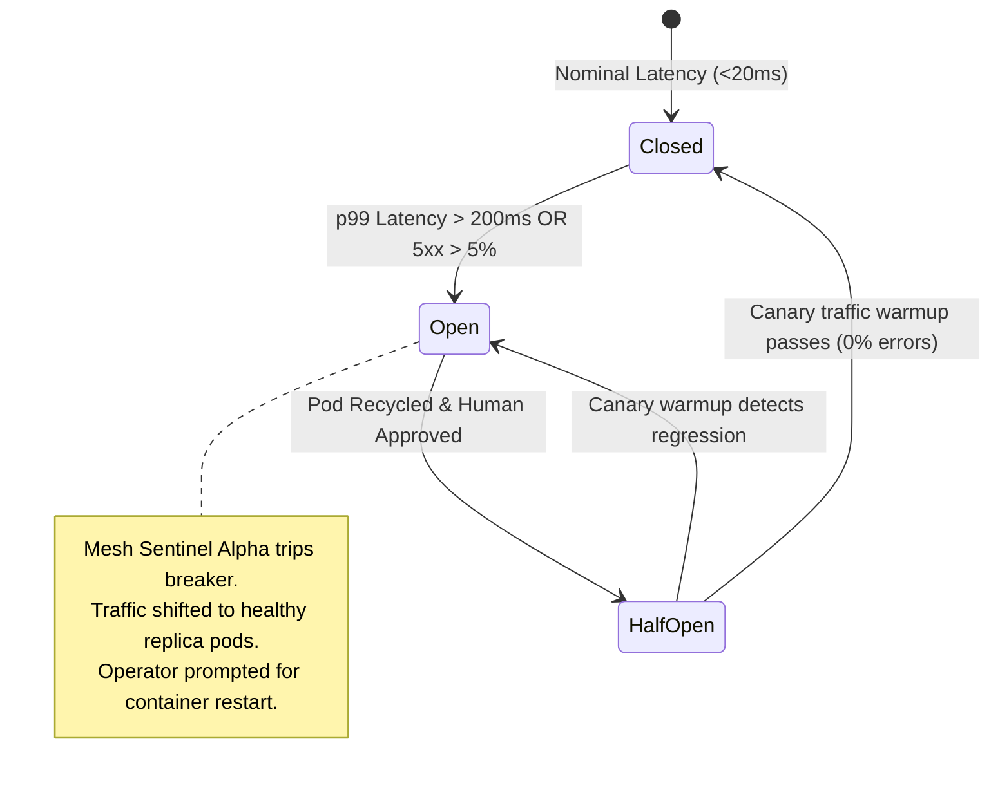

# Go Microservices Fabric — Cloud-Native Mesh & Autonomous AI Watchdog

[](https://alloyce.duckdns.org/mesh)
[](https://golang.org)
[](https://grpc.io)
[](https://www.getambassador.io)
[](https://groq.com)
[](https://n8n.io)

> High-performance distributed Go microservices fabric communicating over low-latency gRPC channels. Fronted by an Ambassador API gateway and hardened by an autonomous Groq AI Circuit-Breaker guardian that isolates failing pods and automates canary recovery.

---

## 1. Mesh Topology Architecture



---

## 2. Microservice Inventory

| Service | Protocol | Default Port | Responsibility | Resiliency Guard |
|---|---|---|---|---|
| **Ambassador Gateway** | HTTP/2 / REST | `:8000` | Ingress TLS termination, JWT validation, rate limiting | Edge rate limiters |
| **Auth Service** | gRPC | `:8001` | Token issuance, cryptographic verification, user claims | Token cache |
| **Orders Service** | gRPC | `:8002` | Distributed order lifecycle & saga transaction coordination | **Circuit Breaker Protected** |
| **Catalog Service** | gRPC | `:8003` | Product schema, pricing index, stock availability | Read replica fallback |
| **Payment Service** | gRPC | `:8004` | External banking interface, credit clearance | Idempotent retries |

---

## 3. Circuit Breaker State Transition & Canary Healing



---

## 4. Live Production Walkthrough

Test live circuit-breaker tripping, fault injection, and canary healing in the interactive cockpit at:
👉 **[https://alloyce.duckdns.org/mesh](https://alloyce.duckdns.org/mesh)**

---

## 5. Repository Structure

```
.
├── services/
│   ├── gateway/     # Ambassador configuration & EnvoyFilters
│   ├── auth/        # Go Auth service (gRPC)
│   ├── orders/      # Go Orders service (gRPC)
│   ├── catalog/     # Go Catalog service (gRPC)
│   └── payment/     # Go Payment service (gRPC)
├── proto/           # Protocol buffer (.proto) definitions
├── workflows/       # n8n Canary warmup pipeline JSON
└── compose.yaml     # Mesh orchestration definition
```
